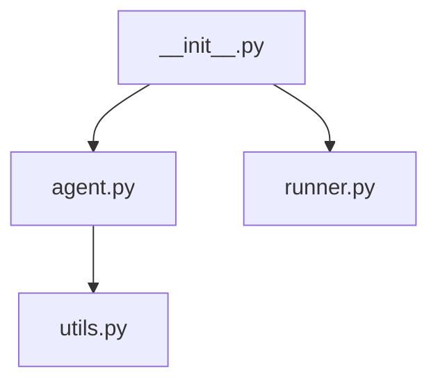
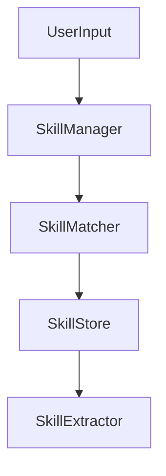
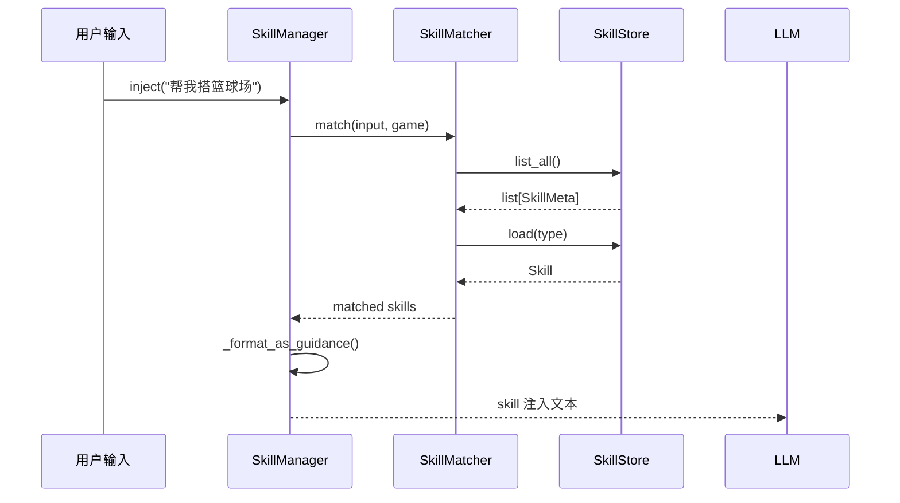

# Codebase Reader

将一个模块/子系统研究透，输出结构化 Markdown 文档。

**核心原则：先 graphify 缩范围，再读源码。**

---

## 工作流程：三层递进

### 第一层：模块总览

**目的**：快速了解模块整体结构，确定关键文件和调用关系。

先用 graphify 快速定位关键文件：

```bash
# 查询模块结构，返回关键类和文件
graphify query "<模块名> 模块结构和调用关系"

# 深入了解核心类/函数
graphify explain "<核心类名>"
```

> **为什么要用 graphify？** 直接读源码效率低，graphify 可以快速返回模块内的关键符号及其调用关系，帮助确定优先读哪些文件。

读取关键源码后，直接在对话中输出：

```markdown
## 模块总览

**模块职责**：一句话描述这个模块做什么、为什么存在

### 调用关系


### 文件一览表
| 文件 | 职责 | 关键函数 |
|---|---|---|
| `agent.py` | 任务编排 | `run()`, `_step()` |
| `runner.py` | 执行计划 | `execute()`, `validate()` |

### 工作流

**数据流**：`输入 → [处理] → 输出`，用加粗标注重难点。
```

**输出示例**（以 skill 模块为例）：

```markdown
## 模块总览

**模块职责**：从成功的场景搭建会话中自动提取经验，并在下一次相似场景搭建时将经验注入给 LLM，实现**知识复用**。

### 调用关系


### 文件一览表
| 文件 | 职责 | 关键函数 |
|---|---|---|
| `store.py` | 持久化 | `SkillStore`, `save()`, `load()` |
| `manager.py` | 门面整合 | `SkillManager`, `inject()`, `extract()` |
| `matcher.py` | 匹配 | `SkillMatcher.match()` |
| `extractor.py` | 提取 | `SkillExtractor.extract_preview()` |
```

---

### 第二层：文件阅读顺序

**目的**：确定先读哪些文件，按依赖顺序从底向上阅读。

用 graphify 确认调用关系后再给出推荐顺序：

```bash
# 查询两个文件之间的调用路径
graphify path "<入口文件>" "<核心文件>"
```

**为什么要确定阅读顺序？** 理解一个模块通常从最底层（被依赖最多的文件）开始，这样读到依赖层时已经有上下文。

```markdown
## 推荐阅读顺序

1. `store.py` —— **最底层，被其他所有文件依赖**
2. `matcher.py` —— 依赖 store
3. `extractor.py` —— 依赖 store 和 prompts
4. `manager.py` —— **最上层，整合所有子模块**
```

文件少（≤3个）时省略此层，直接进第三层。

---

### 第三层：核心代码详解

**目的**：深入理解每个关键函数的具体实现。

一次解读 **2-5 个相关函数**，按逻辑分组。用 graphify 确认函数组所在文件后定位：

```bash
# 定位具体函数
graphify explain "<函数/类名>"
```

每个函数组必须包含以下内容：

```markdown
### 函数组：<函数名>

**文件**：[`src/scenegen/skills/store.py`](file:///data/workspace/scenegen_agent/src/scenegen/skills/store.py#L68-L125)
**行号**：`68-125`
**功能**：详细描述这个函数做什么

---

#### 源码

```python
startLine:endLine:filepath
def _parse_frontmatter(text: str) -> dict:
    """解析 YAML front-matter，只支持标量、内联列表、块列表、整型"""
    result: dict = {}
    lines = text.splitlines()
    i = 0
    while i < len(lines):
        line = lines[i]
        # 跳过空行
        if not line.strip():
            i += 1
            continue
        # 无冒号的行跳过
        if ":" not in line:
            i += 1
            continue

        # 用 partition 而非 split，避免 value 中包含冒号时被错误分割
        key, _, rest = line.partition(":")
        key = key.strip()
        rest = rest.strip()

        if rest.startswith("[") and rest.endswith("]"):
            # 内联列表: [a, b, c]，自动去除引号
            inner = rest[1:-1]
            items = [item.strip().strip('"').strip("'") for item in inner.split(",")]
            result[key] = [item for item in items if item]
            i += 1
        elif rest == "":
            # 空 value，可能是块列表，预读机制向前窥探
            block_items: list[str] = []
            j = i + 1
            while j < len(lines) and lines[j].startswith("  - "):
                block_items.append(lines[j][4:].strip())
                j += 1
            if block_items:
                result[key] = block_items
                i = j  # 跳过已消费的行
            else:
                result[key] = ""
                i += 1
        else:
            # 标量，尝试自动转为 int
            try:
                result[key] = int(rest)
            except ValueError:
                result[key] = rest
            i += 1
    return result
```

#### 详细示例

**示例 1：基础用法**
```python
yaml_text = """
type: basketball_court
name: 篮球场
tags: [篮球, 球场]
version: 1
"""
# 返回: {"type": "basketball_court", "name": "篮球场", "tags": ["篮球", "球场"], "version": 1}
```

**示例 2：块列表**
```python
yaml_text = """
sessions:
  - 20260522_100000_abc
  - 20260522_150000_def
"""
# 返回: {"sessions": ["20260522_100000_abc", "20260522_150000_def"]}
```

**示例 3：空值处理**
```python
yaml_text = """
name:
version: 1
"""
# 返回: {"name": "", "version": 1}
```

#### 连接点

- **被谁调用**：`SkillStore._load()` → `_text_to_skill()` → `_parse_frontmatter()`
- **调用谁**：无，纯文本处理函数
```

---

## 调用链分析

**目的**：理解数据在模块中如何流动。

用 graphify + 源码确认：

```markdown
## 调用链分析

### 注入流程（用户输入 → Skill 文本）



### 数据转换

| 阶段 | 输入 | 处理 | 输出 |
|------|------|------|------|
| 匹配 | `"帮我搭篮球场"` | `SkillMatcher.match()` | `list[Skill]` |
| 格式化 | `list[Skill]` | `_format_as_guidance()` | Markdown 文本 |
| 持久化 | `Skill` | `SkillStore.save()` | `.md` 文件 |
```

---

## 输出格式

直接在对话中输出 markdown，**不写文件**。

### 必需内容清单

| # | 内容 | 说明 | 必需 |
|---|------|------|------|
| 1 | 模块概述 | 做什么、为什么存在 | ✅ |
| 2 | 目录结构 | 文件列表和职责 | ✅ |
| 3 | 调用关系图 | Mermaid 图 | ✅ |
| 4 | 核心 API | 类 + 公共方法 | ✅ |
| 5 | 函数详解 | 每个关键函数 | ✅ |
| 6 | 详细示例 | 每个函数 2-3 个示例 | ✅ |
| 7 | 代码链接 | 指向源文件的可点击链接 | ✅ |
| 8 | 下一步建议 | 用户可以继续深入的内容 | ✅ |

### 源码展示规范

1. **使用代码引用格式**（`startLine:endLine:filepath`）展示完整源码
2. **注释直接写在代码中**，不要单独提取到表格
3. **关键决策点加 inline 注释**，用中文说明
4. 示例代码中的注释也用中文

---

## 触发词

用户可能说：
- "帮我读一下 agent 模块"
- "这个项目是怎么组织的"
- "帮我理解 tools 目录"
- "解释一下 XXX"
- "/codebase-reader" 后跟模块名
- "详细读一下 XXX"
- "带我读细节"

---

## 排版规范

- 标题层级：`##` 为层，`###` 为函数组
- **加粗关键词**：职责、决策点、返回值
- 分隔线 `---` 隔开层，`***` 隔开函数组
- 表格代替列表
- 代码链接格式：`[文件名:行号](file:///absolute/path/to/file#L行)`
- 模块很大（>10 文件）：先输出概览，询问用户想深入哪个子模块

---

## 边界情况

- 模块不存在：搜索项目结构，找到最接近的目录
- 模块太大（>20 文件）：先输出概览，让用户选要深入哪个子模块
- 缺少 docstring：基于代码逻辑推断作用，标注为"推断"
- 多个相似模块：先问用户想读哪一个

---

## 下一步指导

在每次代码阅读完成后，添加"下一步"建议：

```markdown
---

## 下一步

可继续深入以下方向：

1. **子模块深入**：本模块的 `extractor.py` 逻辑较复杂，需要单独详细阅读
2. **调用方分析**：查看 `SkillManager` 被谁调用 → 找到 `meta_tools.py` 中的 `MetaToolDispatcher`
3. **测试用例**：阅读 `tests/test_skill_*.py` 了解预期行为
4. **实际使用**：查看 `cli_skill_extract_batch.py` 了解批量提取 CLI

你想深入哪个方向？
```

**指导原则**：
- 提供 2-4 个可选方向
- 包含具体文件名和理由
- 以问句结尾，让用户选择
